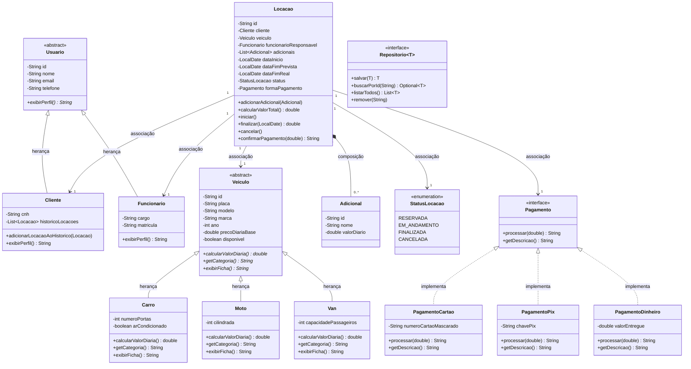

# Locadora de Veículos
## Documentação do Projeto Final — Programação Orientada a Objetos

---

## 1. Integrantes do grupo

- [Nome completo do integrante 1]
- [Nome completo do integrante 2]
- [Nome completo do integrante 3]

---

## 2. Descrição geral do problema e da solução

### O problema

Pequenas e médias locadoras de veículos frequentemente não têm acesso a sistemas de gestão robustos e ainda controlam sua frota, clientes e contratos de forma manual (papel, planilhas soltas ou até WhatsApp). Isso gera uma série de problemas:

- Dificuldade de saber, em tempo real, quais veículos estão disponíveis;
- Falta de controle sobre datas de devolução e possíveis atrasos;
- Ausência de histórico organizado de locações por cliente;
- Cálculo manual e sujeito a erro do valor a cobrar (diária, adicionais, multas).

### A solução

O sistema **Locadora de Veículos** centraliza o fluxo completo de uma locação: cadastro de clientes (com CNH), funcionários, veículos (carros, motos e vans, cada categoria com sua própria regra de precificação) e locações. O sistema permite criar uma locação vinculando cliente, veículo, funcionário responsável, período e forma de pagamento, acompanhar seu status (reservada, em andamento, finalizada ou cancelada) e calcular automaticamente o valor total devido — incluindo multa por atraso na devolução.

O projeto foi desenvolvido como protótipo funcional em Java, com persistência simulada em memória (sem necessidade de banco de dados), e interface textual via terminal.

---

## 3. Requisitos funcionais

| # | Requisito |
|---|---|
| RF01 | O sistema deve permitir cadastrar, listar e consultar clientes, incluindo nome, e-mail, telefone e CNH. |
| RF02 | O sistema deve permitir cadastrar veículos em diferentes categorias (Carro, Moto, Van), cada uma com sua própria regra de cálculo de diária. |
| RF03 | O sistema deve permitir cadastrar funcionários responsáveis por formalizar as locações. |
| RF04 | O sistema deve permitir criar uma locação vinculando um cliente, um veículo disponível, um funcionário, um período (data de início e devolução prevista), itens adicionais (opcional) e uma forma de pagamento (cartão, Pix ou dinheiro). |
| RF05 | O sistema deve controlar a disponibilidade do veículo, marcando-o como indisponível durante a locação e disponível novamente ao ser finalizada ou cancelada. |
| RF06 | O sistema deve calcular o valor total da locação ao finalizá-la, aplicando multa proporcional caso a devolução ocorra após a data prevista. |

---

## 4. Casos de uso

### UC01 — Cadastrar cliente
**Ator principal:** Atendente da locadora
**Fluxo principal:**
1. O atendente seleciona a opção "Cadastrar cliente".
2. O sistema solicita nome, e-mail, telefone e CNH.
3. O atendente informa os dados.
4. O sistema valida se o e-mail e a CNH já não estão cadastrados.
5. O sistema cria o cliente e exibe o ID gerado.

**Fluxo alternativo:** Se o e-mail ou a CNH já existirem, o sistema exibe mensagem de erro e retorna ao menu de clientes.

---

### UC02 — Cadastrar veículo na frota
**Ator principal:** Atendente da locadora
**Fluxo principal:**
1. O atendente seleciona a categoria do veículo (Carro, Moto ou Van).
2. O sistema solicita placa, modelo, marca, ano, preço da diária base e os atributos específicos da categoria (nº de portas/ar-condicionado para carro, cilindrada para moto, capacidade de passageiros para van).
3. O sistema valida os dados informados.
4. O sistema cadastra o veículo com status "disponível" e exibe o ID gerado.

**Fluxo alternativo:** Se a placa, modelo/marca não forem informados ou o preço da diária for inválido, o sistema exibe mensagem de erro.

---

### UC03 — Criar locação
**Ator principal:** Atendente da locadora (em nome do cliente)
**Pré-condição:** Cliente, veículo e funcionário já cadastrados; veículo disponível.
**Fluxo principal:**
1. O atendente seleciona "Criar nova locação".
2. O sistema solicita o ID do cliente, do veículo e do funcionário responsável.
3. O sistema solicita a data de início e a data prevista de devolução.
4. O sistema solicita a forma de pagamento (cartão, Pix ou dinheiro) e os dados específicos dela.
5. Opcionalmente, o atendente adiciona itens extras (seguro, GPS, cadeira infantil), informando nome e valor diário.
6. O sistema calcula o valor total previsto e marca o veículo como indisponível.
7. O sistema exibe o resumo da locação criada, com status inicial "Reservada".

**Fluxo alternativo:** Se o veículo não estiver disponível, ou a data de devolução prevista não for posterior à data de início, o sistema exibe mensagem de erro e cancela a operação.

---

### UC04 — Finalizar locação (devolução do veículo)
**Ator principal:** Atendente da locadora
**Pré-condição:** Locação existente, ainda não finalizada nem cancelada.
**Fluxo principal:**
1. O atendente seleciona "Finalizar locação".
2. O sistema solicita o ID da locação e a data real de devolução.
3. O sistema calcula o valor total, incluindo multa proporcional caso a devolução seja posterior à data prevista.
4. O sistema marca o veículo como disponível novamente e o status da locação como "Finalizada".
5. O sistema processa o pagamento do valor total e exibe a confirmação.

**Fluxo alternativo:** Se a locação não existir ou já tiver sido finalizada/cancelada, o sistema exibe mensagem de erro.

---

### UC05 — Cancelar locação
**Ator principal:** Atendente da locadora
**Pré-condição:** Locação existente e ainda não finalizada.
**Fluxo principal:**
1. O atendente seleciona "Cancelar locação".
2. O sistema solicita o ID da locação.
3. O sistema verifica se a locação ainda não foi finalizada.
4. O sistema altera o status da locação para "Cancelada" e libera o veículo (disponível novamente).

**Fluxo alternativo:** Se a locação já estiver com status "Finalizada", o sistema impede o cancelamento e exibe mensagem de erro.

---

## 5. Diagrama de classes

> O diagrama acima renderiza automaticamente ao visualizar este arquivo no GitHub. Repositórios (`ClienteRepositorio`, `FuncionarioRepositorio`, `VeiculoRepositorio`, `LocacaoRepositorio`) implementam a interface genérica `Repositorio<T>` e não foram incluídos no diagrama de domínio por pertencerem à camada de persistência, não de modelo.

### Relacionamentos principais

- **Herança:** `Cliente` e `Funcionario` herdam de `Usuario` (classe abstrata); `Carro`, `Moto` e `Van` herdam de `Veiculo` (classe abstrata).
- **Composição:** `Locacao` compõe `Adicional` (itens extras contratados, como seguro e GPS).
- **Associação:** `Locacao` se associa a `Cliente`, `Veiculo`, `Funcionario` e `Pagamento`.
- **Realização de interface (polimorfismo):** `PagamentoCartao`, `PagamentoPix` e `PagamentoDinheiro` implementam `Pagamento`; `Carro`, `Moto` e `Van` sobrescrevem `calcularValorDiaria()` de forma diferente, cada um aplicando sua própria regra de precificação.

---

## 6. Boas práticas de POO aplicadas

- **Encapsulamento:** todos os atributos das classes de modelo são privados, acessados via getters/setters.
- **Herança:** `Usuario` (→ `Cliente`, `Funcionario`) e `Veiculo` (→ `Carro`, `Moto`, `Van`) como classes abstratas especializadas.
- **Polimorfismo:** `calcularValorDiaria()`, `getCategoria()` e `exibirFicha()` sobrescritos de forma diferente em cada subtipo de `Veiculo`; interface `Pagamento` com três implementações distintas; `exibirPerfil()` sobrescrito em `Cliente` e `Funcionario`.
- **Interfaces:** `Pagamento` (regra de negócio) e `Repositorio<T>` (contrato genérico de persistência).
- **Coleções:** uso de `List` (adicionais, histórico de locações) e `Map` (armazenamento simulado nos repositórios).
- **Separação em camadas:** `modelo` (domínio), `servico` (regras de negócio), `persistencia` (CRUD simulado) e `ui` (interface com o usuário), seguindo baixo acoplamento entre camadas.
